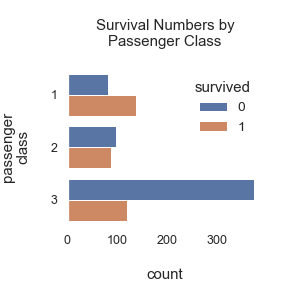
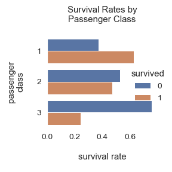
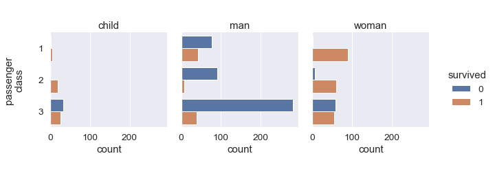
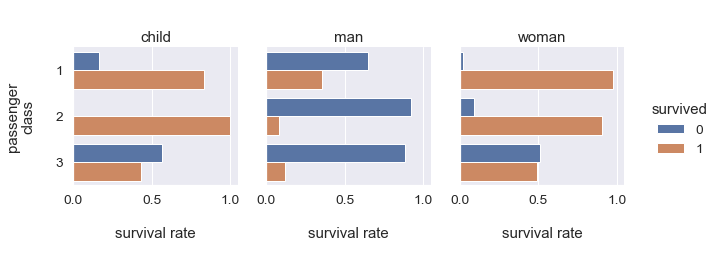

 

* [Analysis](#analysis)
  * [Graphs](#graphs)
  * [Statistical Analysis](#statistical-analysis)
* [Discussion](#discussion)
* [Addendum](#addendum)

 

## Titanic: Did survival rates differ between passenger classes?

The Titanic's passengers data details a few features per passenger.  The features indicate whether a passenger survived the accident, the passenger's lodging 
class, the passenger's ticket fare, etc.  [Contemporaneous investigations](https://www.britannica.com/topic/Titanic) suggests that survival rates might 
have been affected by one or more of the detailed features, and perhaps by extraneous features/events.  Herein, the focus is the question

> Did survival rates depend on passenger class?

 
 

### Analysis

The table summarises survival measures by class.  The table hints at linear relationship between survival rates & class.

<table style="border: 0px solid black; font-size: 10px; margin-left:auto; margin-right:auto;">
    <tr><th>Passenger Class</th><th>1</th><th>2</th><th>3</th></tr>
    <tr><td colspan="4">Survived</td></tr>
    <tr><td>0</td><td>80</td><td>97</td><td>372</td></tr>
    <tr><td>1</td><td>136</td><td>87</td><td>119</td></tr>
    <tr><td colspan="4">Survival Rates</td></tr>
    <tr><td>0</td><td>0.370</td><td>0.527</td><td>0.758</td></tr>
    <tr><td>1</td><td>0.630</td><td>0.473</td><td>0.242</td></tr>
</table>

 

#### Graphs

The rates graph highlights the aforementioned linear relationship between survival rates & passenger class, which begs the 
question &rarr; does a real/significant dependency exist between survival rates & passenger class?

<table style="width: 55%; margin-left: 100px; margin-left:auto; margin-right:auto;">
    <colgroup>
        <col span="1" style="width: 40%;">
        <col span="1" style="width: 40%;">
    </colgroup>
    <tr>
        <td></td>
        <td></td>
    </tr>
</table>

 

#### Statistical Analysis

The question

> Is there a statistically significant dependence between survival & passenger class?

is explored via the &Chi;2 Test of Independence 
[(test data assumptions)](https://www.statology.org/chi-square-test-assumptions/), whereby the hypotheses are

> H0: survival rate <b>independent of</b> passenger class 
> H1: otherwise

The &Chi;2 Test <i>p_value</i> is 4.549 x 10-2323, which - in lay terms - suggests rejecting the null hypothesis 
because its likelihood seems implausible. 

 
 

### Discussion

Approximately 63.0% of first class passengers survived, whereas 47.3% & 24.2% of second & third class passengers, 
respectively, survived.  This led to the question, is there a statistically significant dependence between survival & 
passenger class?  The &Chi;2 Test <i>p_value</i> suggests rejecting 
the _survival rates & class_ independence hypothesis.

The aforementioned contemporaneous investigations indicated that the evacuation policy prioritised class, and then 
females & children.  The policy probably explains why the survival rate declines with class, and why the &Chi;2 Test 
indicates a dependency between survival rate & passenger class.  However, the investigations also indicated that
survival rates might have been affected by each passenger's onboard lodging location.  What combination of variables
dictates a passenger's onboard lodging location?  It is quite possible that class prioritisation, w.r.t. evacuation, did 
not occur, but instead passenger ticket class dictated onboard location, which in turn affected survival chances. 

Further disaggregation by children/woman/man (addendum) does not illustrate a neat association between survival rate & 
evacuation policy steps, i.e.,

> passenger class &rarr; females & children &rarr; males

A number of confounding factors might account for this unclear pattern.  A detailed analysis, and further 
understandings of the period's prevailing rules & customs, will shed more light on unanswered questions.

**Limitations:**
* A few fields have missing values.
* Unfortunately the dataset does not include the onboard lodging location of each passenger.

**Assumptions:**
By conducting a $\chi^{2}$ Squared Test, an implicit assumption is that the dataset consists of independent instances/observations, i.e., the value 
of an observation in the dataset does not affect the value of another observation.

 
 

### Addendum

 

